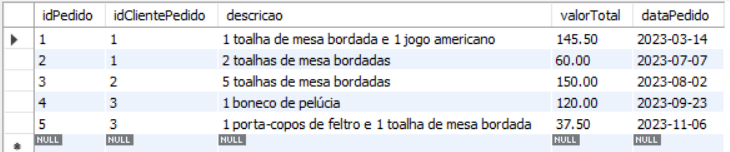
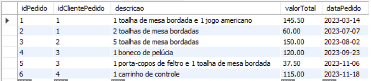
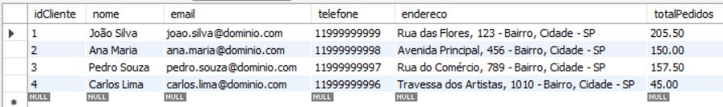
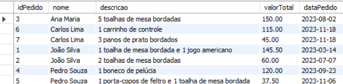

## Objetivo: Criar um sistema de gerenciamento de pedidos em um banco de dados utilizando stored procedures, triggers, views e JOINs no MySQL Workbench.

### Etapa 1: Criação de Tabelas e Inserção de Dados

Crie as tabelas "Clientes" e "Pedidos" com campos apropriados. Insira dados de exemplo nas tabelas para simular clientes e pedidos. Certifique-se de incluir uma chave primária em cada tabela.

```mysql
create table clientes (
    idCliente int primary key auto_increment,
    nome varchar (80) not null,
    email varchar (100) not null,
    telefone varchar (11),
    endereco varchar (200) not null,
    totalPedidos decimal (10,2) default 0
);

create table pedidos (
    idPedido int primary key auto_increment,
    idClientePedido int references clientes (idCliente),
    descricao varchar (200) not null,
    valorTotal decimal (10,2) not null,
    dataPedido date
);

```

### Inserções 
clientes:
```mysql
INSERT INTO Clientes (nome, email, telefone, endereco)
VALUES 
('João Silva', 'joao.silva@dominio.com', '11999999999', 'Rua das Flores, 123 - Bairro, Cidade - SP'),
('Ana Maria', 'ana.maria@dominio.com', '11999999998', 'Avenida Principal, 456 - Bairro, Cidade - SP'),
('Pedro Souza', 'pedro.souza@dominio.com', '11999999997', 'Rua do Comércio, 789 - Bairro, Cidade - SP'),
('Carlos Lima', 'carlos.lima@dominio.com', '11999999996', 'Travessa dos Artistas, 1010 - Bairro, Cidade - SP');
```

Pedidos:
```mysql
INSERT INTO Pedidos (idClientePedido, descricao, valorTotal, dataPedido)
VALUES (1, '1 toalha de mesa bordada e 1 jogo americano', 145.50, '2023-03-14'),
(1, '2 toalhas de mesa bordadas', 60, '2023-07-07'), (2, '5 toalhas de mesa bordadas', 150, '2023-08-02'),
(3, '1 boneco de pelúcia', 120, '2023-09-23'), (3, '1 porta-copos de feltro e 1 toalha de mesa bordada', 37.50, '2023-11-06');

```

### Adicionando o total dos pedidos os clientes 1, 2, 3
```mysql
update clientes set totalPedidos = 205.5 where idCliente = 1;
update clientes set totalPedidos = 150 where idCliente = 2;
update clientes set totalPedidos = 157.50 where idCliente = 3;
```
clientes:


pedidos:



### Etapa 2: Criação de Stored Procedure

Crie uma stored procedure chamada "InserirPedido" que permite inserir um novo pedido na tabela "Pedidos" com as informações apropriadas. A stored procedure deve receber parâmetros como o ID do cliente e os detalhes do pedido. Ao término teste o funcionamento da stored procedure criada inserindo um pedido.

```mysql
delimiter $$
create procedure InserirPedido (
    in cliente int,
    in descricaoPedido varchar (200),
    in valorPedido decimal (10,2),
    in data_pedido date
)
begin
  insert into pedidos (idClientePedido, descricao, valorTotal, dataPedido)
  values (cliente, descricaoPedido, valorPedido, data_pedido);
end $$
delimiter ;

```
Agora só chamar a stored
```mysql

call InserirPedido (4, '1 carrinho de controle', 115, now());
```


### Etapa 3: Trigger

Crie uma trigger que seja acionada APÓS a inserção de um novo pedido na tabela "Pedidos". A trigger deve calcular o valor total dos pedidos para o cliente correspondente e atualizar um campo "TotalPedidos" na tabela "Clientes" com o valor total. Teste a Trigger inserindo um novo pedido na tabela "Pedidos“.

```mysql
delimiter $$
create trigger AtualizarTotalPedidos
after insert on pedidos
for each row
begin
	update clientes set totalPedidos = totalPedidos + NEW.valorTotal
	WHERE idCliente = NEW.idClientePedido;
end $$
delimiter ;
```
Inserindo um produto para analisar o trigger:
```mysql
call InserirPedido (4, '3 panos de prato bordados', 45, now());
select * from clientes;
```


podemos ver que o cliente 4 atualizou o total de pedidos

### Etapa 4: View

Crie uma view chamada "PedidosClientes" que combina informações das tabelas "Clientes" e "Pedidos" usando JOIN para mostrar os detalhes dos pedidos e os nomes dos clientes.
```mysql
create view PedidosClientes as
	select p.idPedido, c.nome, p.descricao, p.valorTotal, p.dataPedido
	from pedidos p inner join clientes c on p.idClientePedido = c.idCliente
	order by c.nome;
    
    select * from PedidosClientes;
```


